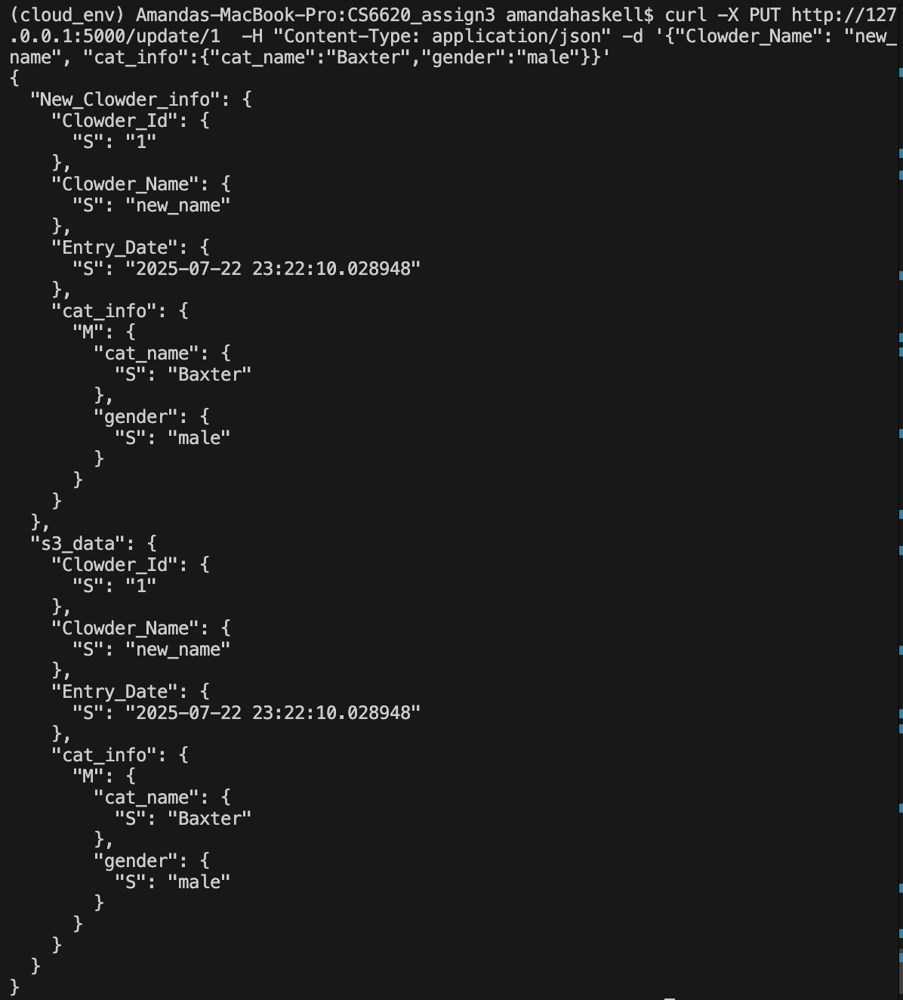

# CS6620_assign3
# CI/CD pipeline (part 3) - Orchestration and CRUD

### Add functionality to create, read, update, and destroy items in a DynamoDB table and an S3 bucket. Use Localstack to run a mock of AWS as part of your application stack. 

### Create two compose files and corresponding shell scripts:

[Docker Compose File for Manual Tests](docker-compose.yml)

[Shell Script to Run Localstack and Flask app](run_local_stack.sh)

[Docker Compose File for Manual Tests](docker-compose-tests.yml)

[Shell Script to Run Localstack and Flask app](run_tests_assign_3.sh)

### one will run the stack until manually stopped, 

To set up container and terraform use the command line an run ./run_local_stack.sh

### the other will run the tests and exit with a zero status if the tests pass and a non-zero status if the tests fail. 

To manually run tests use the command line and run: ./run_tests_assign_3.sh

*note: you will need to manually destroy terraform between runs for back to back testing runs*

### Put all relevant files into a repository, and enable automatic and manual runs of the tests using a workflow. 

.github/workflows/docker-image.yml

### Include a README along with instructions for running the stack and tests

- Sending a GET request with no parameters returns the appropriate response

http://127.0.0.1:5000

- Sending a POST request results in the JSON body being stored as an item in the database, and an object in an S3 bucket

Clicking submit will redirect to the page below.

- Sending a GET request with appropriate parameters returns expected JSON from the database

http://127.0.0.1:5000/1

- Sending a GET request that finds no results returns the appropriate response:

http://127.0.0.1:5000/0

- Sending a GET request with incorrect parameters returns the appropriate response

http://127.0.0.1:5000/a

- Sending a duplicate POST request returns the appropriate response

1 entered as Clowder ID and submit clicked

- Sending a PUT request that targets an existing resource results in updates to the appropriate item in the database and object in the S3 bucket

Entering the following code in the terminal: 

curl -X PUT http://127.0.0.1:5000/update/1  -H "Content-Type: application/json" -d '{"Clowder_Name": "new_name", "cat_info":{"cat_name":"Baxter","gender":"male"}}'

Results in the following terminal output:

and updates to http://127.0.0.1:5000/1

- Sending a PUT request with no valid target returns the appropriate response

Running the following curl (same as above but with 0 as clowder id): 

curl -X PUT http://127.0.0.1:5000/update/0  -H "Content-Type: application/json" -d '{"Clowder_Name": "new_name",
 "cat_info":{"cat_name":"Baxter","gender":"male"}}'

Results in the following response:

- Sending a DELETE request results in the appropriate item being removed from the database and object being removed from the S3 bucket

Running the following command:

curl -i -H "Content-Type: application/json" -X DELETE http://127.0.0.1:5000/delete/1

Results in the following terminal output:

- Sending a DELETE request with no valid target returns the appropriate response

Running the same curl again results in the following terminal output:

### References:
- https://docs.aws.amazon.com/amazondynamodb/latest/developerguide/DynamoDBLocal.DownloadingAndRunning.html

- https://medium.com/@pushpam.ankit/setting-up-localstack-and-dynamodb-tables-with-docker-and-terraform-44e2811d554d

- https://medium.com/@clinton.bitcoin/localstack-terraform-part-2-b3f80e59250 

- https://docs.localstack.cloud/aws/tutorials/s3-static-website-terraform/

- https://docs.localstack.cloud/aws/integrations/infrastructure-as-code/terraform/

- https://github.com/aws-samples/localstack-terraform-test/tree/main

- https://python.plainenglish.io/python-flask-taking-user-input-using-forms-5032bd2a5333

- https://github.com/clinton-pillay7/localstack-tutorial/blob/master/localstack/wsgi.py

- https://boto3.amazonaws.com/v1/documentation/api/latest/reference/services/dynamodb.html

- https://boto3.amazonaws.com/v1/documentation/api/latest/reference/services/s3.html

- https://www.fernandomc.com/posts/ten-examples-of-getting-data-from-dynamodb-with-python-and-boto3/

- https://stackoverflow.com/questions/61749489/getting-could-not-connect-to-the-endpoint-url-error-with-boto3-when-deploying

- https://docs.aws.amazon.com/amazondynamodb/latest/developerguide/Expressions.UpdateExpressions.html

- https://flask.palletsprojects.com/en/stable/testing/#fixtures

- https://towardsthecloud.com/blog/aws-sdk-key-exists-s3-bucket-boto3

- https://towardsthecloud.com/blog/aws-sdk-write-data-amazon-s3-boto3

- https://www.geeksforgeeks.org/python/redirecting-to-url-in-flask/

- https://github.com/hashicorp/setup-terraform

- https://docs.python.org/3/library/inspect.html

- https://share.google/qZbd1E3m1va9HJ0wf

- Google AI Overview. Search terms: ["localstack dynamodb docker compose", "terraform dynamodb localstack", "run flask app localstack", "update item dynamodb with python dictionary"]
